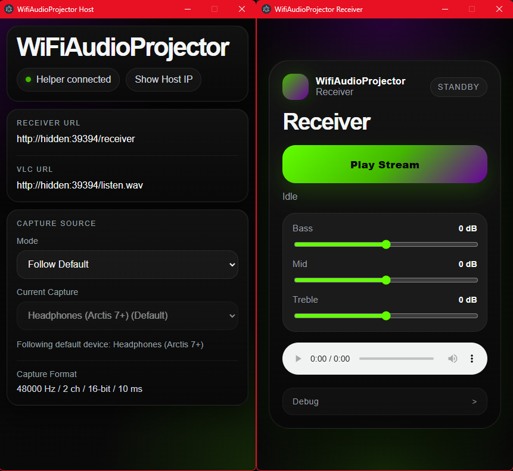

# WifiAudioProjector (WAP)

Live audio bridge from a PC to another device over local WiFi.

## Vision

The host machine captures live system audio, publishes it on the LAN, and receiver device's discover and play that stream through whatever output is currently connected to the receiver device, including Bluetooth headphones.

## How to use it:

1. Run "Start WifiAudioProjector.bat".
2. Initial run will check for the required dependencies (Node.js, npm packages, Electron, .NET 8 SDK/runtime), automatically downloading them to the source folder if needed.
3. Host window will open, displaying the receiver URL, which you can open in a web browser on your receiver device (phone, tablet, whatever). NOTE: Opening and running on same machine will create infinite feedback loop.
4. Tap `Start Audio` from the receiver device.
   
## Known issues:

1. Occasional fuzzy playback after listening for 5-10 minutes.
2. Switching default audio device doesn't automatically switch when "Follow Default Device" is selected.
2. Not the best quality, quality was sacrificed a bit to have lower latency.
3. Web based, not app based.
